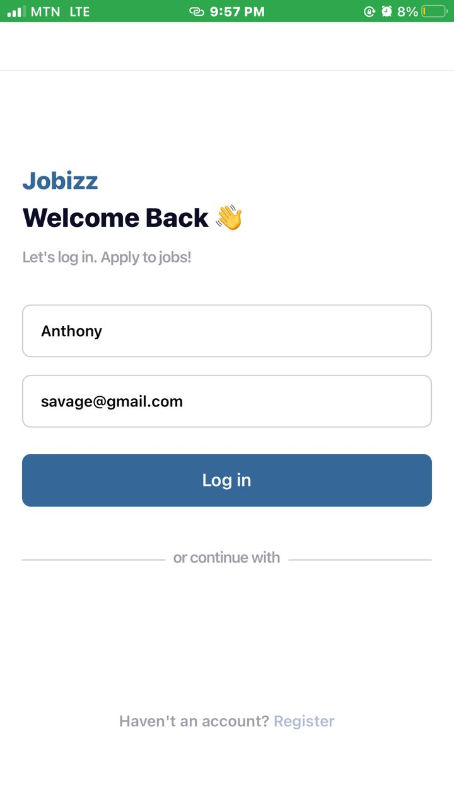

# rn-assignment4-11313275
# Jobizz App

Jobizz is a simple job listing application that allows users to log in and browse featured and popular job listings. This app is built using React Native and utilizes the React Navigation library for navigation between screens.

## Components

### App.js
- **Usage**: The main entry point of the application.
- **Description**: Sets up the navigation stack using React Navigation. It includes two screens: `LoginScreen` and `HomeScreen`.

### LoginScreen.js
- **Usage**: The initial screen that the user sees when opening the app.
- **Description**: Allows users to input their name and email to log in. It includes social login buttons for Apple, Google, and Facebook.
- **Screenshot**:
  ![Login Screen]
  

### HomeScreen.js
- **Usage**: Displays after the user logs in.
- **Description**: Shows the user's name and email at the top, provides a search bar to search for jobs, and lists featured and popular jobs. Each job card displays job title, company, salary, and location.
- **Screenshot**:
  ![Home Screen]

## Installation

1. Clone the repository:
   ```sh
   git clone https://github.com/yourusername/jobizz-app.git
